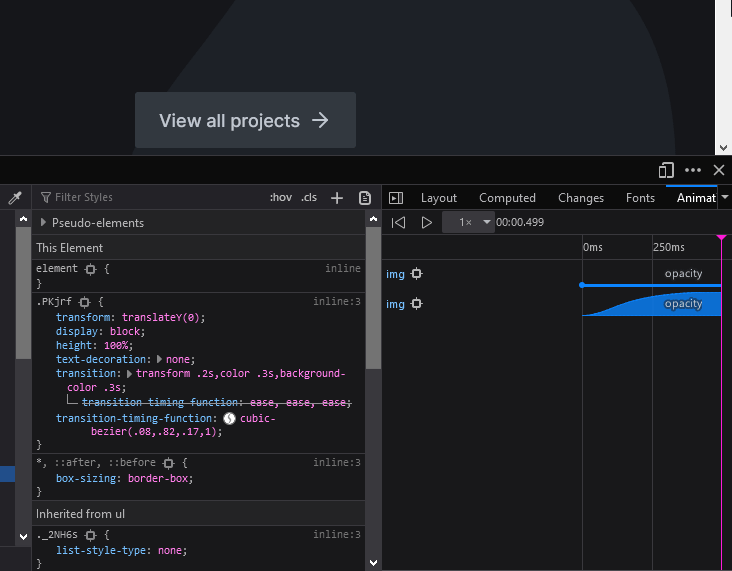

<Notice>
  This article assumes some basic knowledge of HTML and CSS. If you don't know what those technologies are, you probably won't get much out of it.
</Notice>

Firefox provides some fantastic tools for developers, and if you can take advantage of these tools, you're productivity will skyrocket.

Assuming you've already mastered the basic tools, such as the HTML inspector and the JavaScript console.

# Shift+Click Shades to Change Format

You can cycle through colour formats. 

Why: you can take full advantage of the intuitive power of the HSL format (see my other article on colour for why HSL is so great), but you can also swap to hexadecimal if you need to extract a colour and enter it into another program.

https://www.seanbailey.dev/articles/tips-for-developers-working-with-colour

# Timing Function Editor

<Figure caption="The timing function editor in the CSS selector panel">

</Figure>

# Accessibility Inspector

- Search for issues throughout the page
- Explore the accessibility tree to understand how a screen reader sees your page

# Font Editing tools

For visually adjusting the appearance of your type.

# Grid and Flexbox Visualisations