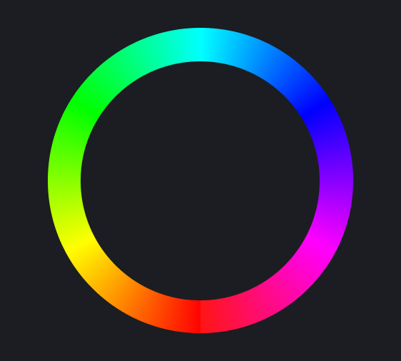

<!-- @format -->

I've been working on a brand new update for my personal site recently,
[seanbailey.dev][mysite], and part of that process involves trawling through old
projects, screenshots, videos, and sketches, to try and develop a coherent
portfolio. This provides a fantastic opportunity to reflect on my progress as a
designer, and I think the area this is most evident, is in my use of colour.

As a [slightly colour blind][deuteranomaly] software developer, learning to make
the most of colour has always been challenging. I figure there must be at least
a few other developers out there experiencing the same difficulty, so I'd like
to share some lessons I've learnt over the course of my relatively short career.

[mysite]: https://www.seanbailey.dev
[deuteranomaly]: https://en.wikipedia.org/wiki/Color_blindness#Deuteranomaly

# Tip 1: Use HSL

A lot of developers fall for the common mistake of formatting their colours in
hexadecimal (e.g. `#FFFFFF`). Hex is a great format for sharing shades, and is
pretty much universally understood by creative software tools and websites. But
the thing about Hex is that it's difficult for our primate brains to comprehend,
because it's based around red, green, and blue.

HSL however, is far more intuitive. It's composed of three observable properties
of colour: **hue**, **saturation**, and **lightness**. You can think of **hue**
as the base colour of your shade. It's actually a measure of rotation around a
colour wheel (pictured below), so you typically express hue in degrees or
radians.

# Tip 2: Develop a Colour Palette

Use a limited number of shades, and don't mutate them at runtime by
darkening/lightening, saturating or rotating hue.

# Tip 3: Use Saturation with Care

If everything is over saturated, you're eyes will bleed. One highly satured
accent colour will draw your attention without causing harm to the eyes.
Remember: art is expansion, design is contraction. So simplify your interfaces
by removing excess saturation.

# Tip 4: Test on Different Screens and Devices

Colours may show up beautifully for you, but if you're monitor is incorrectly
configured, you may use colours that look hideous on other screens.

# Tip 5: Consider your Greys

Whether your greys are warm, neutral, or cool can have a huge huge but subtle
impact on the feel of your site. Getting this right can be a delicate dance.

# Remember: Your Mileage May Vary

Colour is a slightly subjective field, rooted in the arts. Some of these tips
may not apply to your project.

Now go out into the world and add some colour!

---

Photo by [Steve Johnson][steve] on [Unsplash][unsplash]

[steve]: https://unsplash.com/@steve_j?utm_source=unsplash&amp;utm_medium=referral&amp;utm_content=creditCopyText
[unsplash]: https://unsplash.com/s/photos/colour?utm_source=unsplash&amp;utm_medium=referral&amp;utm_content=creditCopyText
