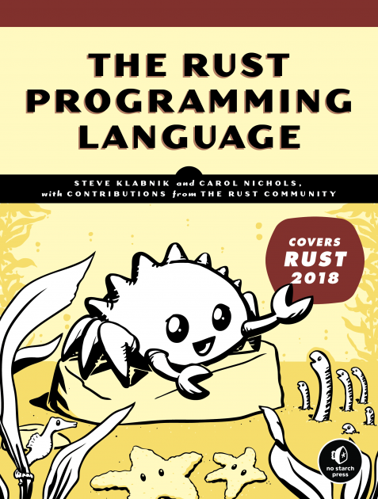

<!-- @format -->

Rust is a brilliant language, offering a rather unique combination of
performance, safety, and a great community. But for many new comers, Rust is
also a daunting challenge. The language has a far steeper learning curve than
say JavaScript or Ruby. But as someone who recently overcame that learning
curve, I can confidently say that it's not as challenging as it may look from
the outside.

> **Note**: This article assumes some knowledge of programming outside of Rust.
> Skills you've learnt in other languages will transfer well, and make your
> experience quite a bit smoother. If you're completely new to programming, I
> suggest you learn some generic programming concepts first.

## Start with the Book

The Rust book is a brilliant resource, written by the members of the Rust core
team. It covers just about every topic you can imagine, and outlines the
motivation behind Rust's many design decisions. Don't stress about reading every
word of every chapter. Just make sure you understand Rust's core
concepts—especially **ownership and borrowing**.

<Figure caption="The front cover of the Rust Book. Source:
https://nostarch.com/Rust2018">



</Figure>

If you haven't found the book yet, start there! You can read it [online for
free][online], purchase it as an [ebook or paperback][paperback], or check out
the [source code on GitHub][github].

[online]: https://doc.rust-lang.org/stable/book/title-page.html
[paperback]: https://nostarch.com/Rust2018
[github]: https://github.com/rust-lang/book

## Learn to Love the Compiler

The first time I strayed from a tutorial, and began trying to write my own Rust
code, I found myself in a constant struggle with the compiler. At times, it felt
like you couldn't do anything to get that pesky compiler off your back. This
experience is common amongst new Rustaceans.

The Rust compiler is incredibly strict, particularly when it comes to managing
ownership and borrowing. This strictness is what causes the language to be so
difficult to adopt, but is also the languages greatest strength.

- The core team knows this is an issue, so they've tried extra hard to make the
  error messages as useful as possible. If you see an error message from the
  compiler and you don't immediately understand what the issue is, then you need
  to return to the book or do some research and work on your Rust theory.

- The better you understand Rust's ownership and borrowing model, the less
  you'll find yourself *fighting with the borrow checker*, and the greater your
  code quality.

## Expect to be Challenged

Like any language, Rust will challenge your existing notions, approaches, and
patterns. But in my career so far, I've yet to encounter a language that has
challenged my quite as much as Rust has.

- Many approaches and design patterns that are totally acceptable on other
  languages, aren't allowed in Rust. This can be a frustrating experience,
  because at times you may find yourself questioning: well why the hell not?
  
- ECS
- AnyMap

## Love the Little Things

You've almost certainly been lambasted with all the great things that Rust will
do for you at this point. From memory safety, to performance, to preventing race
conditions. But the things that really keep me interested in Rust are the little
things. 

### Enums & Pattern Matching

```rust
enum Colour {
    HSL { hue: f32, saturation: f32, lightness: f32 },
    RGB { red: u8, green: u8, blue: u8 },
}
```

-   Rust has a powerful module/crate system. Leverage it to organise your code,
    and prevent any one thing from growing to large, too quickly.

-   Rust is a great language that introduces a bunch of great paradigms. The enums
    in Rust are a real joy to work with, and I love that I can write my own macros
    that
