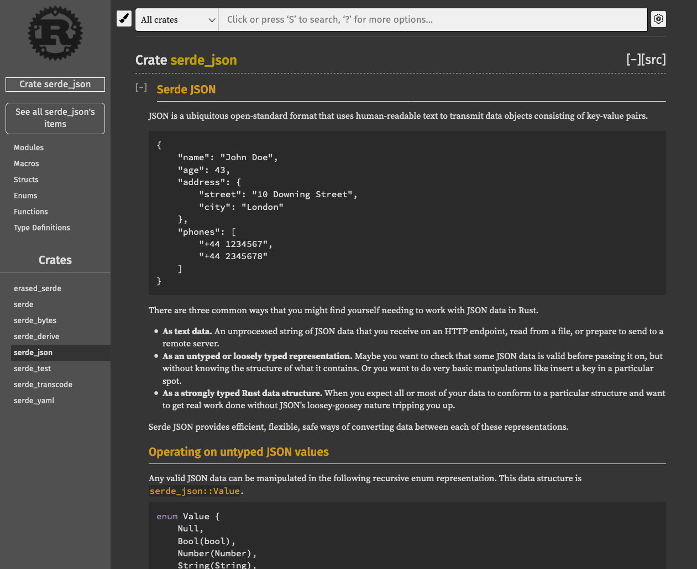

<!-- @format -->

Rust is a brilliant language, offering a rather unique combination of
performance, safety, and a great community. But for many new comers, Rust is
also a daunting challenge. The language has a far steeper learning curve than
say JavaScript or Ruby. In this article, I'd like to take a moment to talk about
that learning curve, and my experience learning Rust. If you're also new to
Rust, you may find this article to be a helpful guide for navigating some common
pitfalls.

> **Note**: This article assumes some knowledge of programming outside of Rust.
> Skills you've learnt in other languages will transfer well, and make your
> experience quite a bit smoother. If you're completely new to programming, I
> suggest you learn some generic programming concepts first.

## It All Starts with the Book

I heard a lot of great things about [the Rust book][online] before I started
programming. It's touted as the be-all-and-end-all resource for learning the
language, and it's written by members of the Rust core team. It's also 100% free
and [open source][github], and who could complain about that?

[online]: https://doc.rust-lang.org/stable/book/title-page.html
[github]: https://github.com/rust-lang/book

<Figure caption="Source: https://nostarch.com/Rust2018">

</Figure>

The book is a brilliant resource, covering just about every topic you could
imagine—and then some. A word of warning though: don't make the same mistake as
me, and try to read through the book like a novel. It's just not that kind of
book. The first few chapters are super valuable (especially the chapter on
ownership and borrowing), but after that you should really treat it as a kind of
reference—a reference that tells a story, provides context and warns about
potential pitfalls.

## Deciphering the Docs

Rust ships with a great documentation tool called rustdoc. It converts the
docstrings in your code into a powerful web interface

<Figure caption="Source: https://docs.serde.rs/serde_json/">

</Figure>

## Resources

https://www.rust-lang.org/learn
