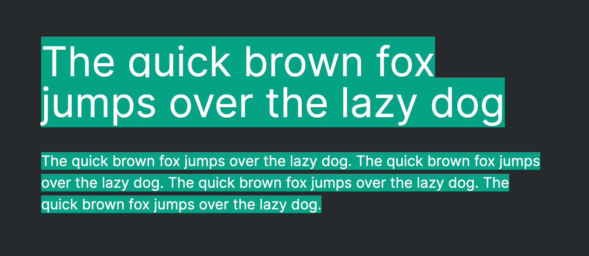

If you're paying attention to the web development scene right now, you may have
heard about a library called [Tailwind][tailwind]. Compared to the other popular
libraries of 2021, Tailwind is a rather unique and interesting case. It offers
an unparalleled development experience, and a fresh new perspective on styling
on the web.

I'd like to give you a taste of what Tailwind has to offer in this article, but
if you really want to see what all the fuss is about, the best thing to do is to
[try it out for yourself](https://tailwindcss.com/docs/installation).

[css-in-js]: https://en.m.wikipedia.org/wiki/CSS-in-JS

# Introducing Tailwind

Tailwind CSS is a "utility-first CSS framework" from [Adam Wathan][adam]. If you
don't know what a utility-first CSS framework is, it's probably easiest just to
quickly show you. Here's some plain HTML + CSS without Tailwind:

```html
<style>
  .copy {
    color: red;
    font-weight: medium;
    margin-top: 1rem;
    margin-bottom: 1rem;
  }
</style>

<p class="copy">Hello, world</p>
```

...and here is the equivalent markup when using Tailwind:

```html
<p class="text-red-500 font-medium my-4">Hello, world</p>
```

With utility-first CSS, instead of creating CSS selectors and stylesheets, we
simply apply a collection of CSS-like utility classes. Because these classes
leverage your existing CSS knowledge, you can be up and running with Tailwind in
no time at all.

[adam]: https://adamwathan.me/

# Boilerplate, begone!

Utility based CSS is an unexpected stroke of genius. You no longer need to
create and link up CSS files, or trudge through the boilerplate of a library
like styled-components or Treat. Just configure Tailwind once at the project
level, and then developers can quickly and easily add styles to markup.

Tailwind also provides a powerful breakpoint system, which helps you create
responsive designs faster with fewer lines of code. Here's a quick sample using
pure CSS to generate a responsive grid:

```html
<style>
  .grid {
    display: grid;
    grid-template-columns: 1fr;
  }

  @media (min-width: 640px) {
    .grid {
      grid-template-columns: repeat(2, 1fr);
    }
  }

  @media (min-width: 1024px) {
    .grid {
      grid-template-columns: repeat(3, 1fr);
    }
  }
</style>

<div class="grid">...</div>
```

Now compare that to the tailwind equivalent:

```html
<div class="grid grid-cols-1 sm:grid-cols-2 lg:grid-cols-3">...</div>
```

The end result is functionally identical, but you didn't spend all that time
writing media queries, properties and selectors. Plus, anyone that comes along
after you to maintain that CSS only needs read a single line to understand how
the layout works.

# Design smarter, not harder

One subtle, yet powerful feature of Tailwind, is that it comes packed with a
bunch of great design thinking built in. It encourages you to follow a number of
good practices without even knowing it. Here's a best practice you may have
encountered before:

> Smaller text sizes should have a larger line height (the amount of vertical
> space between two lines of text). This helps the eye to easily track from the
> end of one line, to the start of another.

With that good design practice in mind, there are two possible outcomes I can
see when working with copy on your website:

1. You spend time ensuring that the line height is correct for all the copy in
   your website. Your users thank you.
2. You don't know about this good practice, or decide not to follow it, and the
   text on your website is less accessible and harder to read.

But there is a secret third option!

3. Let Tailwind automatically handle the line height for you, according to the
   size of the text.

```html
<p className="text-5xl">The quick brown fox jumps over the lazy dog</p>

<p className="text-md">
  The quick brown fox jumps over the lazy dog. The quick brown fox jumps over
  the lazy dog. The quick brown fox jumps over the lazy dog. The quick brown fox
  jumps over the lazy dog.
</p>
```

With the above markup, plus some added highlighting, we should see something
like the below example. Notice how there is a small gap between each line of the
smaller text?

<Figure caption="Smaller text, requires larger spaces between each line.">



</Figure>

So save yourself some time and energy, and just let your library do some design
lifting for you! 💪 And that's just one of the many things that Tailwind can do
for your project, it also:

1. Comes with a **CSS reset** to make things consistent across browsers, apply
   some sensible defaults, and give you a blank canvas to work from.
2. Encourages you to use a **spacing scale**, to keep things consistent and add
   rhythm to your page.
3. Offers a spectacular range of **hand picked colour palettes**. Helping to
   keep your colour use consistent and meaningful.

# Closing thoughts

Tailwind is highly opinionated, yet highly configurable. To me, this is the
perfect balance for a library: it helps you out every way it can, but gets out
of the way when it really matters.

I am _very_ critical of the tech I use in projects, and I cannot recommend
Tailwind enough. If you can't take my word for it, all I ask is this: [give it a
try][get-started]. You'll fall in love too.

[tailwind]: https://tailwindcss.com/
[get-started]: https://tailwindcss.com/docs/installation
