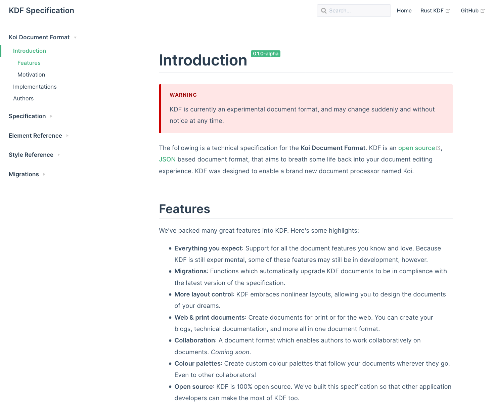
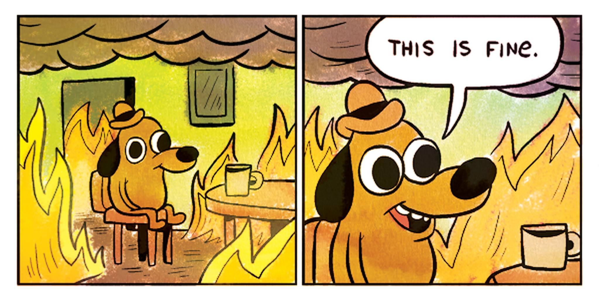

Earlier this year, I made the difficult decision to kill off a side project
I was very passionate about. Whenever something like this happens, it always
rocks me to my core. But instead of rolling up into the pheotal position in bed
and crying myself to sleep, I'd like to take a moment to reflect on the cruicial
mistakes I made with that project. And hopefully in doing so, we can all learn
something from my flaming wreckage.

# It all starts with an idea

I decided to design a document editor. One that ignores decades of convention
and tradition, and instead focuses on providing a simple, enjoyable experience.
Sounds simple enough right?

Here's the thing about reimagining something that's been around for decades:
**you have to reinvent some wheels**. For example, you can't just reuse an
existing document format like `.docx` or `.odt`, because those formats were
designed to support the exact structure your attempting to avoid. So now you're
also going to need your very own document format, with a carefully crafted
specification. And so a few months go by...

<Figure caption="Koi Document Format. My very own, JSON based document format,
that will forever remain half completed.">

</Figure>

But wait a second! You can't just build your own document format. You need to
support the existing document formats, or else no one will ever want to use your
product right? At the _least_ we'll need to import `.docx` files given their
popularity. So now you need to read through a 5,000 page document format
specification, supporting as many features described as possible. And so a few
more months go by...

Whew, thank god that's done! The hard part must surely be over now. Right? Well
we haven't actually started working on the document renderer yet. That's right,
the thing that's responsible for rendering a custom document format consistently
accross different operating systems hasn't been built yet. Ahh no worries, time
to get to work. And once again, a months fly by...

<Figure caption="Wow. Things are going great!">

</Figure>

And now things are _sort of_ coming together. You've started having nightmares
about text wrapping algorithms, but try not to let that get to you. Soon you'll
be able to start implementing some of those great features you thought of! Wait
a minute... what about:

- Document templates
- Colour palettes
- Editor themes
- Online collaboration
- A product page
- A feedback form in the app
- Social media accounts
- Spelling and grammar checks? Why am I only thinking of this now!
- Ooh! Maybe a _design checker_ that reviews the design of your document?
- ...
-
- Oh no...

# So what went wrong?

Well two things actually. Firstly, I failed to prototype enough. If I spent some real time
prototyping early on, I could have avoided the 18+ month development time
because I would have realised earlier on just how challenging and resource
intensive a project of this scope and nature would be.
If I had prototyped sooner, I would have failed faster, and I could move on
to a different, more viable project sooner.

Secondly, I failed to keep things simple. I got lost in the idea, fleshing it
out in all different directions instead of focusing on the core of the idea.
