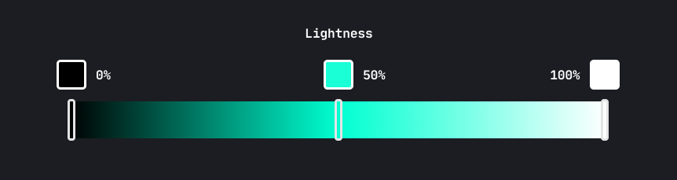

<!-- @format -->

I've been working on a brand new update for my personal site recently,
[seanbailey.dev][mysite], and part of that process involves trawling through old
projects, screenshots, videos, and sketches, to try and develop a coherent
portfolio. This provides a fantastic opportunity to reflect on my progress as a
designer, and I think the area this is most evident, is in my use of colour.

As a [slightly colour blind][deuteranomaly] software developer, learning to make
the most of colour has always been challenging. I figure there must be at least
a few other developers out there experiencing the same difficulty, so I'd like
to share some lessons I've learnt over the course of my relatively short career.

[mysite]: https://www.seanbailey.dev
[deuteranomaly]: https://en.wikipedia.org/wiki/Color_blindness#Deuteranomaly

# Improve Your Quality of Life With HSL

A lot of developers fall for the common mistake of formatting their colours in
hexadecimal (e.g. `#FFFFFF`). Hex is a great format for sharing shades, and is
pretty much universally understood by creative software tools and websites. But
the thing about Hex is that it's difficult for our primate brains to comprehend,
because it's based around red, green, and blue.

HSL however, is far more intuitive. It's composed of three observable properties
of colour: **hue**, **saturation**, and **lightness**. You can think of **hue**
as the base colour of your shade. It's actually a measure of rotation around a
colour wheel (pictured below), so you typically express hue in degrees or
radians. When working with HSL, you can easily change the base of a colour by
rotating the hue a few degrees. Try doing that with hex!

<Figure caption="Source: Sean Bailey. Released under CC0, no rights reserved.">

</Figure>

**Saturation** measures a colour's intensity. A more saturated colour is more
vibrant. A less satured colour moves closer to greyscale. You can use this to
your advantage to create vibrant colours that should draw attention, or faded
colours that should retreat into the background.

A word of warning: be careful not to go too crazy with the saturation of your
shades. Pumping up the saturation on all your colours will result in visual
noise, which can be quite an unpleasant experience. Instead, use saturation as a
tool for creating heirarchy in your content. 

<Figure caption="Source: Sean Bailey. Released under CC0, no rights reserved.">

</Figure>

**Lightness**, as you might expect, describes how much light is reflected from
the colour. By cranking the lightness to 100% you get white, and turning it down
to 0% gives you black.

<Figure caption="Source: Sean Bailey. Released under CC0, no rights reserved.">

</Figure>

# Use Colour Palettes to Maximise Consistency

Another common mistake made by developers, is choosing one or two colours and
then manipulating them as needed. The problem with this approach, is that when
your interface starts growing, you start getting 30-40 different shades of the
same colour, and things start to look a bit inconsistent. **Remember!**
Consistency is essential in interface design.

Instead, take some time to create a colour palette before you add any colours to
your interace. It can be a time consuming process, but having a finite number of
shades will really make your interace feel more _designed_. There are
[loads][coolors] [of][colorhunt] [tools][paletton] out there to help you with this process.

<Figure caption="The colour palette I designed for Koi">

</Figure>

Here's a sample colour palette that I created for a previous project, [Koi][koi].
You should probably develop your own method for creating palettes, but here's
a rough rundown of my approach:

1. **Choose some base hues**. I typically choose one primary hue, one hue for
   my background shades, and a few utility hues for things like _danger_,
   _success_, and _warning_.

2. **Pick some shades**. Sometimes I use tools like [palettte.app][palettte] to
   help with this process, but doing things by eye is usually better than trying
   to find some mathematically perfect shade. You'll likely want more shades for
   your greys, all the way from dark to light, and only a few shades for your
   primary and utility colours.

3. **Iterate!** The only way to create a great colour palette is to actually try
   it out. I often take 10-15 stabs at colours before I get something I'm happy
   with, and continue to tweak them in future when I think I can make slight
   improvements.

[koi]: /projects/koi
[coolors]: https://coolors.co/
[colorhunt]: https://colorhunt.co/
[palettte]: https://palettte.app/
[paletton]: https://paletton.com/

# Test on Many Different Screens

As you know, there are thousands of different screens and device types out
there, and each display colour in a slightly different way. To make it even
more difficult, lighting conditions in the viewers room, and differences in
colour perception between individuals, can really mess up your hand crafted
colour palettes. As if working with colour wasn't hard enough already.

To help mimise the variation of my colour palettes, I always try to design on
the most colour accurate monitor available to me. You can also use Windows' or
Mac's built in colour calibration wizards. These tools well help make sure your
monitor settings are as correct as they can be.

And as the title of this section suggests, you should also try your designs in
as many different conditions as possible. You may find that your text colour is
no longer accessible when the display is exposed to bright sunlight, or that the
boundary between two sections is invisible on cheap monitors.

Now go out into the world and add some colour!
