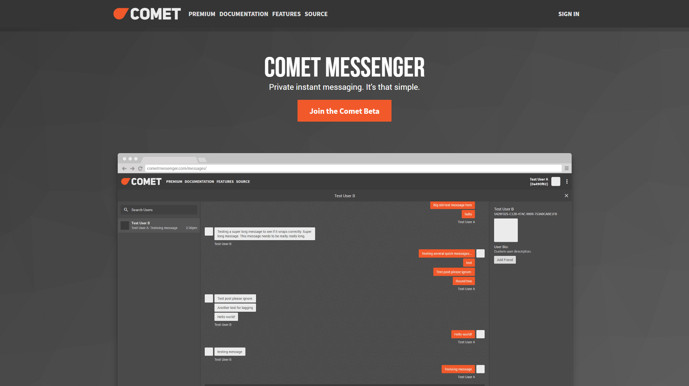
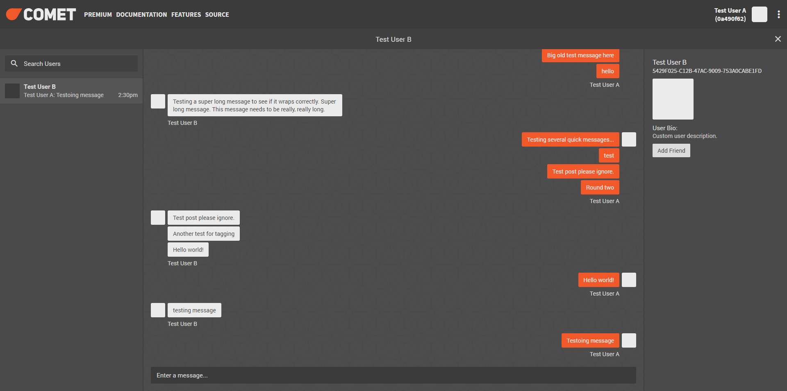
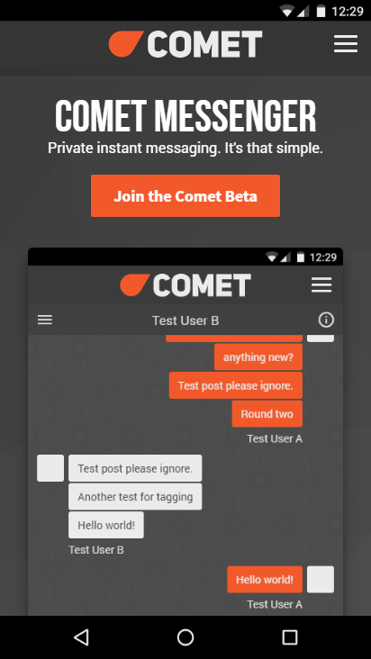
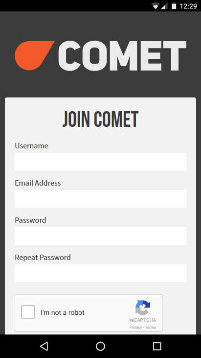
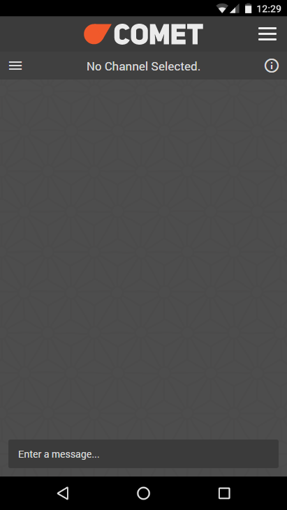
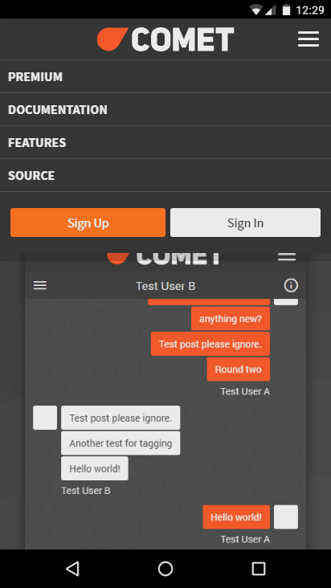
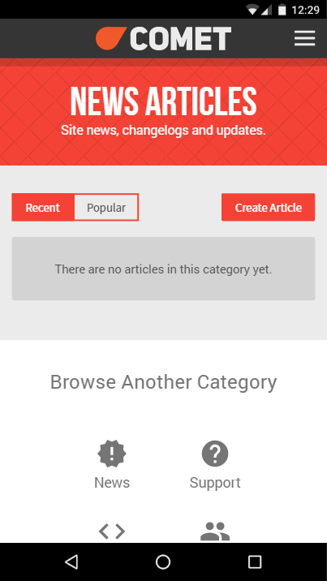
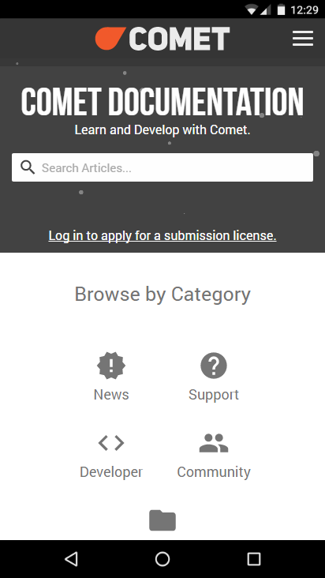
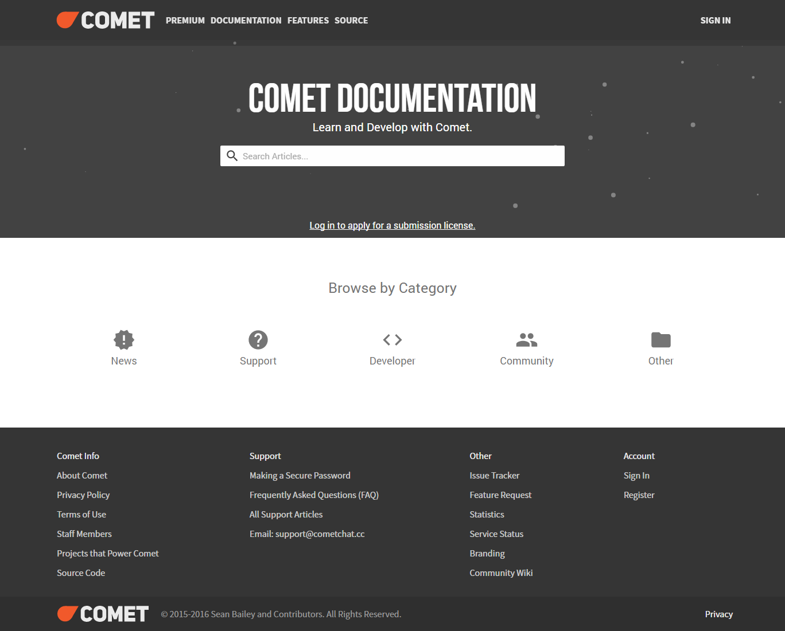

<!-- @format -->

<Columns>
<TwoColumns>

Comet was a private instant messaging service that I designed and developed over
the course of a year for my Year 12 Major Design Project (MDP). Facebook
Messenger was widely used accross my high school campus, but few students were
really aware of the highly invasive practices employed by Facebook. My aim was
to start a discussion amongst students about our privacy online, and develop an
alternative platform that emphasized privacy and security.

</TwoColumns>
</Columns>

---

<Columns>

<ColumnSpacer />
<TwoColumns>

## My First Web App

Comet was built using the [Django][django] web framework, with a sprinkle of
support from [socket.io][socketio] for opening and managing socket connections.
This marked the first time I had ever built a dynamic web application, and
I couldn't be more proud of the result. I still remember the first time
I managed to send a message to a friend via the service.

[django]: https://www.djangoproject.com/
[socketio]: https://socket.io/

</TwoColumns>

<Column>

## Landing Page

The messenger home page was my first deep dive into building a product page.
It may not look like much, but I spent many, many hours painstakingly
peicing this together by hand.

</Column>

<TwoColumns>

</TwoColumns>

<Column>

## Messaging UI

This simple messaging interface was designed to be reminiscent of Facebook
Messenger's web interface, where a list of previous conversations with people
and groups are listed on the left.

If you look closely at the messages seen in the window, you'll notice they're
utter giberish. This screenshot was taken the first time I got messaging
functionality working, and I never came around and took a more appropriate shot
later.

</Column>

<TwoColumns>

</TwoColumns>

</Columns>

---

<Columns>

<ColumnSpacer />

<TwoColumns>

## Responsive Design

Comet was also my first time developing a fully responsive website. I knew that
many people would want to use an instant messaging service on their phone, so
supporting all screen sizes was a requirement from the beginning.

I was particularly proud of the way that the navigation becomes bundled up
within a dropdown menu on smaller screens.

</TwoColumns>

</Columns>

---

<Columns>

<TwoColumns>

</TwoColumns>

<Column>

## Documentation

Comet included an entire sub website for documentation. However, since the
website never went live, I never felt the need to fill anything out here. It was
more an exercise to explore designing a search experience.

I remember being hugely inspired by [developers.google.com][docsinspiration] at
the time of creation, although I'm sure that website has changed significantly
since then.

[docsinspiration]: https://developers.google.com/

</Column>

</Columns>
