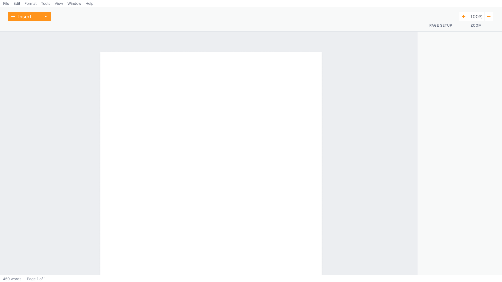
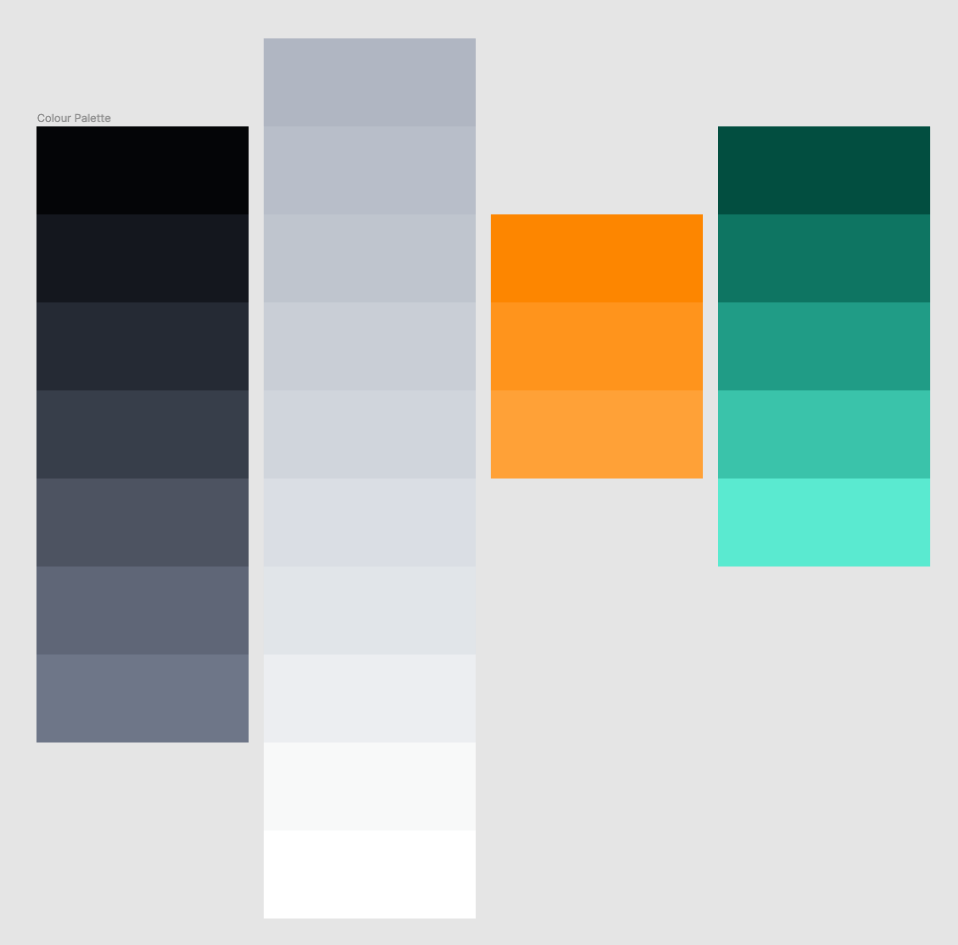

<!-- @format -->

<Columns>
<TwoColumns>

Koi was a desktop document editor I designed and developed over the course of
a year and a half. The goal was to radically rethink the way we edit documents,
introducing a more intuitive and simplified editing experience.

<IncompleteWarning />

</TwoColumns>
</Columns>

---

<Columns>
<Column></Column>
<TwoColumns>

## Design Mode

Koi's powerful editing experience stems from its two distinct editing modes.
_Design mode_ is reminiscent of a typical document processor, but is primarily
focused on developing the appearance of your document.

Focusing on the documents design allows us to provide specialised design tools,
far more powerful and far less ambiguous than anything found in existing
solutions. We're solving two different problems in two different places.

</TwoColumns>

<ThreeColumns>

</ThreeColumns>
</Columns>

---

<Columns>
<TwoColumns>

## Content Mode

Content mode is Koi's primary editing mode. It allows you to focus in on the
text and structure of your document, and tune out the noise. Because content
mode is so focused, we can provide you with powerful content specific tools to
plan, restructure, and compose your documents.

</TwoColumns>
<ThreeColumns>

</ThreeColumns>
</Columns>

---

<Columns>
<Column>

## Design Rework

Before the project was cancelled, I was in the middle of reworking the entire
design. The goal was to create an interface that suited the new brand name Koi.
This screenshot shows a sample of the interface very early on.

</Column>

<TwoColumns>

</TwoColumns>

<Column></Column>

<Column>

</Column>

</Columns>
