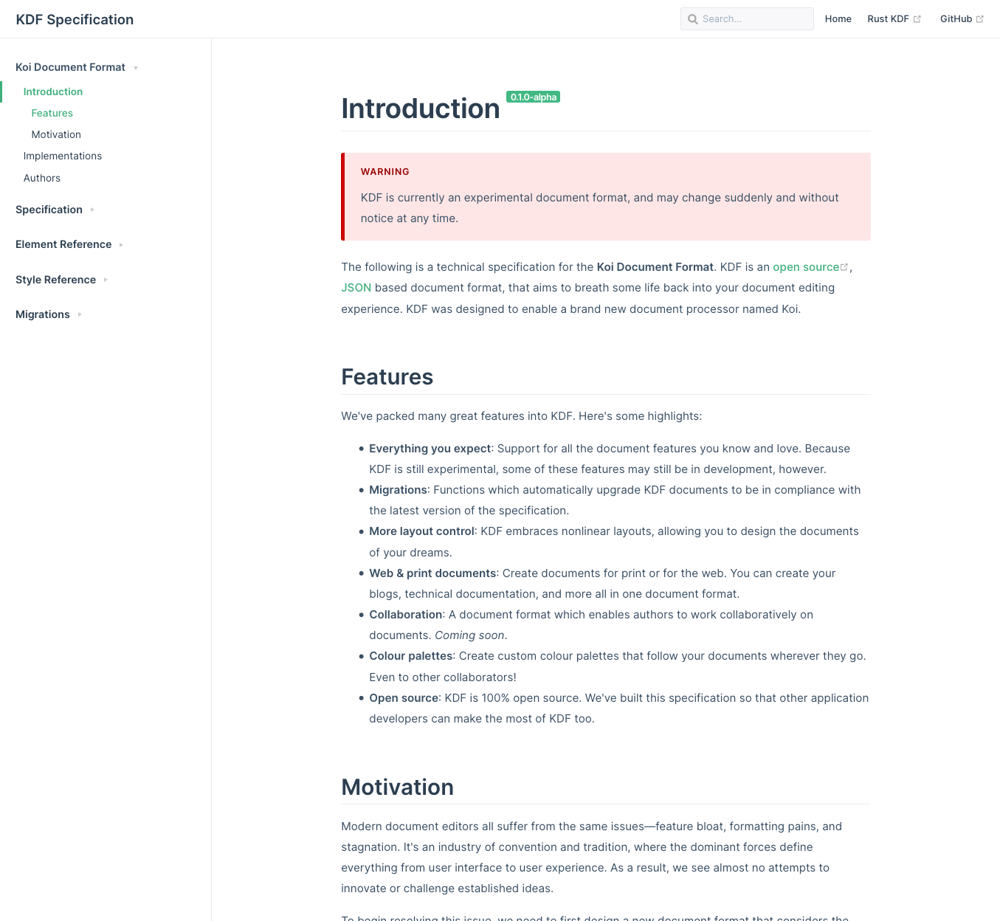

<!-- @format -->

<Columns>
<TwoColumns>

Koi was a desktop document editor I designed and developed, with the hopes of
building and marketing a consumer product. The goal was to radically rethink the
way we edit documents, introducing a more intuitive and simplified editing
experience.

Unfortunately, things didn't work out. The project was just far too large in
scope, and involved several incredibly complex problems that could be projects
in their own right. I still believe that Koi was solving a real problem, and
could be a successful product. So perhaps one day I will return with more
resources.

<IncompleteWarning />

</TwoColumns>
</Columns>

---

<Columns>
<TwoColumns>

## Editing Modes

Koi's powerful editing experience stems from its two distinct editing modes.
_Design mode_ is reminiscent of a typical document processor, but is primarily
focused on developing the appearance of your document. Whilst _Content mode_
allows you to focus in on the textual content.

</TwoColumns>
<TwoColumns>

</TwoColumns>
<Column>

## Design Mode

Focusing on the documents design allows us to provide specialised design tools,
far more powerful and far less ambiguous than anything found in existing
solutions. We're solving two different problems in two different places.

</Column>
</Columns>

<Columns>
<TwoColumns>

</TwoColumns>
<Column>

## Content Mode

Content mode is Koi's primary editing mode. It allows you to focus in on the
text and structure of your document, and tune out the noise. Because content
mode is so focused, we can provide you with powerful content specific tools to
plan, restructure, and compose your documents.

</Column>
</Columns>

---

<Columns>
<TwoColumns>

</TwoColumns>

<Column>

## Koi Document Format

One of the greatest problems with existing formats, is that they're bound by
dated and bloated document formats.

To help break away from these formats, I designed a JSON based document format,
with a focus on iteration and improvement over time, that is also significantly
simpler than anything that already exists.

You can checkout the half written document specification at [kdf.now.sh][kdf].

[kdf]: https://kdf.now.sh/

</Column>
</Columns>

