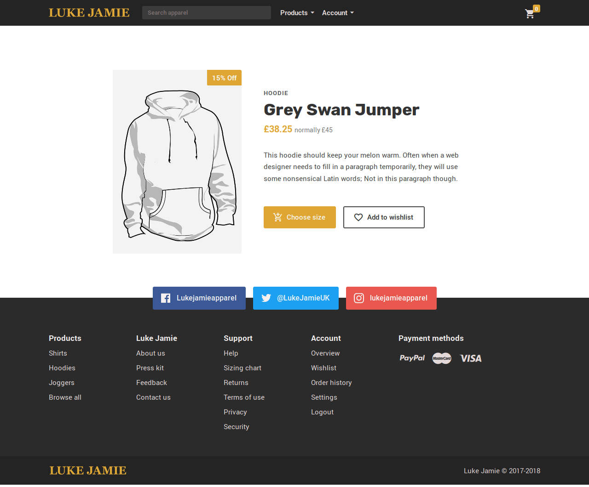
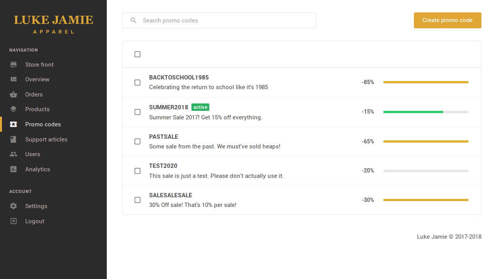

<!-- @format -->

<Columns>
<TwoColumns>

Luke Jamie Apparel was a high-end British men's apparel store. They boasted
uniquely designed and manufactured clothing with a royal vibe, aimed at a
demographic of young men. The project was started by a friend of mine, but
unfortunately was cancelled before it launched.

<IncompleteWarning />

</TwoColumns>
</Columns>

---

<Columns>
<ColumnSpacer />
<TwoColumns>

## It Starts With a Product

The first focus of the project was to build out the product page. Here you can
see an early version of what that page would look like, including the signature
Luke Jamie colour scheme, and a typically product page layout.

</TwoColumns>
<Column>

## Header and Footer

At this stage, a lot of time and energy had been spent iteration on the designs
for the page header and footer. We landed in a nice place, but if I could change
one thing I'd make the social buttons in the footer far less intense. They're
actually drawing attention away from the product...

</Column>
<TwoColumns>

</TwoColumns>
</Columns>
<Columns>
<Column>

## Admin Panel

There also needs to be an interface for Luke Jamie staff members to edit and add
products, set prices, and create sales. The admin panel was also set to include
analytics, a list of users, and more.

This part of the website was ultimately the least developed when the project was
cancelled, but I really loved that left navigation.

</Column>
<TwoColumns>

</TwoColumns>
</Columns>

---

<Columns>
<Column>

## Responsive Design

The website also supported responsive design, although unfortunately this is the
only image remaining from that time.

</Column>
<Column>

</Column>
</Columns>
