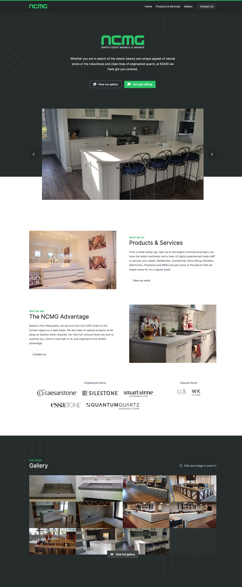

<!-- @format -->

<Columns>
<TwoColumns>

In 2018, North Coast Marble & Granite reached out for a total redesign of their
current website. I worked with their team to design and develop a solution to
perfectly fit their needs, and hosted the website in the cloud. We collaborated
again in 2020 to update the content of the site, and improve look and feel.

You can view the completed, live site at [ncmg.com.au][ncmg].

[ncmg]: https://ncmg.com.au

</TwoColumns>
</Columns>

---

---

<Columns>

<Column>

## Staff Area

The staff area is a cordoned off location, only accessible to NCMG staff
members. It allows staff to upload and edit images, view all submitted messages,
and manage some generic site settings.

</Column>

<TwoColumns>

</TwoColumns>

</Columns>

---

<Columns>

<ColumnSpacer />

<TwoColumns>

## Full Mobile Support

The entire website, from landing page to staff area, is 100% mobile compatible.

</TwoColumns>

</Columns>

---

<Columns>

<TwoColumns>

</TwoColumns>

<Column>

## Style Guide

During the design phase, I built out a small static website to act as a style
guide for the final product. It detailed branding & logos that would be used, as
well as a complete colour palette and an exploration of typography
& iconography.

You can view the style guide online at [ncmg.seanbailey.io][styleguide].

[styleguide]: https://ncmg.seanbailey.io/

</Column>

</Columns>
